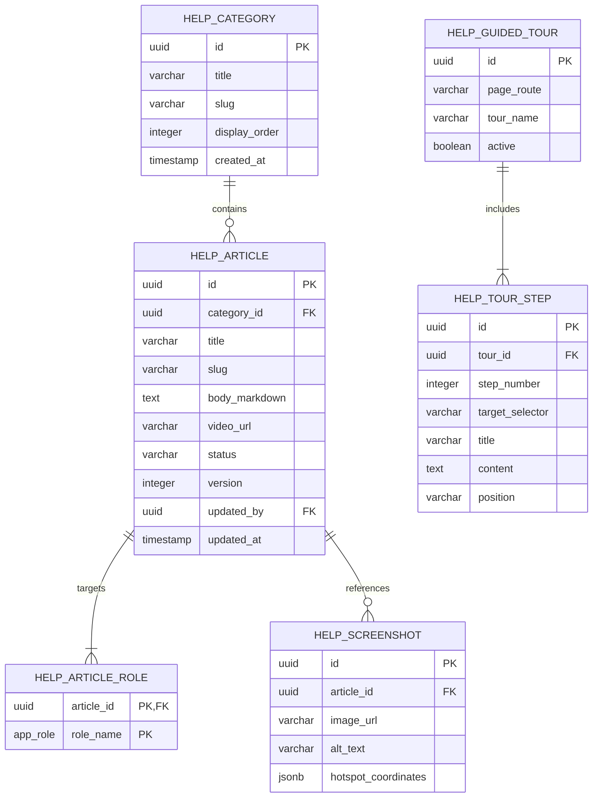
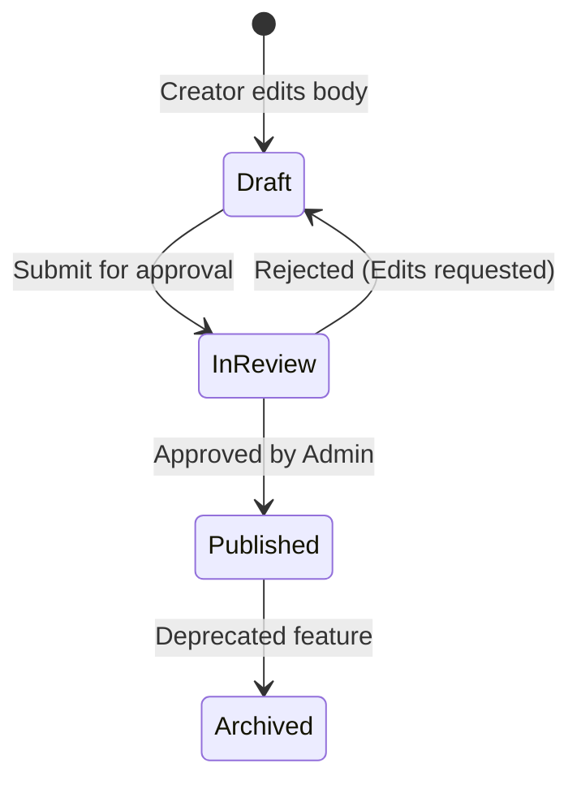

# Distribo Documentation & Training Center Strategy
**Document Version:** 1.0.0  
**Author:** Senior Product Consultant & Technical Architect  
**Target System:** Distribo Distribution Management System (DMS)  
**Status:** Planning & Architectural Blueprint (No Code)

---

## 🧭 1. Executive Summary & Product Strategy

In a large-scale distribution management system like **Distribo**, the user base is highly fragmented. Users range from high-level financial analysts and super admins in corporate offices to field-based sales representatives and independent vendors in rural zones who may operate under low-bandwidth networks and varying levels of digital literacy. 

The **Documentation & Training Center (DTC)** is designed not merely as a passive help file, but as an active, context-aware onboarding engine. The strategic goals are:
- **Accelerate Time-to-Onboard (TTO):** Reduce field onboarding from 5 days to under 4 hours.
- **Deflect Level-1 Support Tickets:** Deflect at least 65% of operational queries (e.g. *"how do I reconcile cash?"*, *"how do I register a returned asset?"*).
- **Ensure Process Compliance:** Enforce step-by-step verification flows (such as mileage logging or physical inventory count signatures) using guided checklists.
- **Provide Contextual Guidance:** Deliver help when and where the user needs it (inline, hover, and overlay) instead of forcing them to leave their current workspace.

---

## 📂 2. Information Architecture (IA)

The Documentation Center uses a multi-dimensional hierarchical model. Articles are tagged by **Module**, **User Role**, and **Complexity Level** to enable dynamic rendering.

```
Learning Center
├── 🏁 Getting Started
│   ├── Platform Overview & Value Proposition
│   ├── Login, Password Recovery, and 2FA
│   └── Mobile App Installation & Offline Modes
├── 👥 User Role Playbooks
│   ├── Vendor Handbook
│   ├── Sales Representative Guide
│   ├── Territory Manager Operations
│   ├── Finance Officer Operations
│   ├── Operations Officer Workflows
│   ├── Inventory Officer Handbook
│   ├── Auditor Compliance Manual
│   └── Admin & Super Admin Core Management
├── 🏗️ Operations Module Guides
│   ├── Vendor Registration & Profile Setup
│   ├── Shift Check-In / Check-Out & Mileage Auditing
│   ├── Refrigerator & Vehicle Asset Allocation
│   ├── Depot Load-Out & Stock Allocation
│   └── Cash & Returned Stock Reconciliation
├── 📦 Inventory Module Guides
│   ├── Inbound Deliveries & Supplier Purchase Orders
│   ├── Barcode/QR Code Scanner Troubleshooting
│   └── Stock Level Auditing & Physical Variance Checks
├── 💳 Finance Module Guides
│   ├── Recording Bulk & Retail Sales
│   ├── Payment Tracking, Invoices & Credits
│   ├── Mobile Money Disbursements (Integrations)
│   └── Vendor Dues & Account Statements
├── 📊 Analytics & Reporting
│   ├── Performance Metrics & KPI Scorecards
│   └── Geolocation Maps & Breadcrumb Tracking
├── 🎁 Vendor Loyalty & Programs
│   ├── Performance Incentives & Gift Redemptions
│   └── Fan Academy Training & Certifications
├── ⚙️ System Administration
│   ├── Depot & Outlet Configuration
│   ├── Product Catalogue Setup & Pricing Rules
│   ├── Commission Structuring & Payout Flows
│   ├── Demand Forecasting Models
│   ├── User Account Management & RBAC Matrices
│   └── System Audit Trails & Security Controls
├── ❓ Frequently Asked Questions (FAQs)
├── 🔧 System Troubleshooting & Error Codes
└── 📢 Release Notes & Feature Updates
```

---

## 🗺️ 3. Navigation & Contextual UI/UX Architecture

The help features are split into three layers: **Global Help**, **Contextual/Inline Help**, and **Interactive Walkthroughs**.

```
                           +--------------------------------+
                           |       GLOBAL HELP PORTAL       |
                           |  (Search, Playbooks, Videos)   |
                           +--------------------------------+
                                           |
                                           v
                           +--------------------------------+
                           |      CONTEXTUAL HELP ICON      |
                           |  (Located in Top Header Bar)   |
                           +--------------------------------+
                                           |
                    +----------------------+----------------------+
                    |                                             |
                    v                                             v
     +------------------------------+              +------------------------------+
     |       INLINE TOOLTIPS        |              |     INTERACTIVE TOURS        |
     |   (Hover states over KPIs,   |              |  (Guided walk-throughs for   |
     |    form input labels, etc.)  |              |   complex multi-step forms)  |
     +------------------------------+              +------------------------------+
```

### 3.1 Contextual Help Trigger (In-App Overlay)
- **Design:** A floating `?` icon or a header button labeled `Help & Tutorials` is present on every route.
- **Behavior:** Clicking this button does not navigate away. Instead, it opens a **sliding side-drawer (sheet)** displaying:
  1. *Context-relevant articles:* If on `/stock-recalc`, it loads articles on variance thresholds.
  2. *Quick Video Tutorial:* A 60-second video relevant to the active module.
  3. *Launch Walkthrough button:* Starts a guided tour of the current page.

### 3.2 UI/UX Element Placement Matrix

| Element Type | Use Case | Visual Treatment |
| :--- | :--- | :--- |
| **Inline Tooltips** | Technical definitions (e.g. "Variance", "Credit Term Days"). | Small grey `info` icon. Hover reveals a glassmorphic tooltip card. |
| **Empty State Guidance** | New dashboards or lists with no active items. | Illustration showing target action + brief text + prominent "Get Started Guide" button. |
| **Guided Tours** | First-time login or complex multi-step processes. | Highlighted page element with backdrop overlay + popup card with "Next/Skip" options. |
| **Quick Tips Banner** | Alerts or tips regarding seasonal changes or system updates. | Amber notice banner at the top of a page (collapsible). |
| **Interactive Walkthroughs** | Performing reconciliation or entering a sale. | Stepper interface embedded in the forms to guide completion. |

---

## 🗄️ 4. Recommended Database Schema

To support versioning, draft workflows, role-based visibility, and screenshot mappings, we recommend the following relational structure (PostgreSQL):



### Schema Definition Details

```sql
CREATE TYPE help_article_status AS ENUM ('draft', 'review', 'published', 'archived');

CREATE TABLE public.help_categories (
  id uuid PRIMARY KEY DEFAULT gen_random_uuid(),
  title varchar(100) NOT NULL,
  slug varchar(100) UNIQUE NOT NULL,
  display_order integer DEFAULT 0,
  created_at timestamptz DEFAULT now()
);

CREATE TABLE public.help_articles (
  id uuid PRIMARY KEY DEFAULT gen_random_uuid(),
  category_id uuid REFERENCES public.help_categories(id) ON DELETE SET NULL,
  title varchar(200) NOT NULL,
  slug varchar(200) UNIQUE NOT NULL,
  body_markdown text NOT NULL,
  video_url varchar(255),
  status help_article_status DEFAULT 'draft',
  version integer DEFAULT 1,
  updated_by uuid REFERENCES auth.users(id),
  updated_at timestamptz DEFAULT now()
);

CREATE TABLE public.help_article_roles (
  article_id uuid REFERENCES public.help_articles(id) ON DELETE CASCADE,
  role_name app_role NOT NULL,
  PRIMARY KEY (article_id, role_name)
);

CREATE TABLE public.help_screenshots (
  id uuid PRIMARY KEY DEFAULT gen_random_uuid(),
  article_id uuid REFERENCES public.help_articles(id) ON DELETE CASCADE,
  image_url varchar(255) NOT NULL,
  alt_text varchar(255),
  hotspot_coordinates jsonb, -- Format: { "zones": [ { "x": 10, "y": 20, "w": 50, "h": 30, "label": "Naira Icon" } ] }
  created_at timestamptz DEFAULT now()
);

CREATE TABLE public.help_guided_tours (
  id uuid PRIMARY KEY DEFAULT gen_random_uuid(),
  page_route varchar(100) UNIQUE NOT NULL,
  tour_name varchar(150) NOT NULL,
  active boolean DEFAULT true
);

CREATE TABLE public.help_tour_steps (
  id uuid PRIMARY KEY DEFAULT gen_random_uuid(),
  tour_id uuid REFERENCES public.help_guided_tours(id) ON DELETE CASCADE,
  step_number integer NOT NULL,
  target_selector varchar(100) NOT NULL, -- e.g., '#add-depot-btn'
  title varchar(100) NOT NULL,
  content text NOT NULL,
  position varchar(20) DEFAULT 'bottom', -- top, bottom, left, right
  UNIQUE (tour_id, step_number)
);
```

---

## 📸 5. Screenshot & Annotation Strategy

A screenshot strategy is necessary to prevent images from becoming obsolete when the UI layout evolves. 

```
               [ RAW SCREENSHOT UPLOADER (WebP) ]
                              │
                              ▼
           [ CANVAS EDITING & ANNOTATION LAYER ]
          ┌──────────────────────────────────────────┐
          │  • Interactive Spotlights (CSS Clip)     │
          │  • Annotation Hotspots (SVG Overlay)      │
          │  • Text Labels & Tooltip Callouts        │
          └──────────────────────────────────────────┘
                              │
                              ▼
           [ DYNAMIC SCREENSHOT DISPLAY LAYER ]
```

### 5.1 Hotspot & Overlay System
Instead of uploading static images with hardcoded red arrows, we will use a **Dynamic SVG Annotation Layer** overlaying the raw screenshot:
- **Raw Image:** An unannotated screenshot of the page, compressed to WebP.
- **JSON Metadata:** Stores coordinates of highlight zones and labels.
- **Overlay Rendering:** A custom frontend wrapper (`<AnnotatedImage />`) renders the raw image and draws SVG circles, highlight rings, and callout labels dynamically. When a selector changes, we update the JSON coordinates rather than recreating the graphic.

### 5.2 Screenshot Specifications

| Page Target | Highlight Zones | Callout Labels | Placement in Guide |
| :--- | :--- | :--- | :--- |
| **Sales Entry** | Customer Select, Product Quantities, Cash/Credit Toggle, Submit Button. | "1: Select Vendor", "2: Enter Quantities", "3: Choose Payment Type". | Directly after the "How to Log a Sale" header. |
| **Stock Recalc** | Run Diff button, Mismatch Table, Variance Badges, Apply Corrections button. | "1: Generate Stock Audit", "2: Review Mismatch Alerts", "3: Apply Database Overwrite". | Integrated inside the "Admin Variance Audit" section. |
| **Inbound Stock** | Adjust Stock button, Invoice Upload, Add Line Item button. | "1: Record Supplier Invoice", "2: Upload Invoice POD", "3: Validate items". | Placed inside the "Inbound Delivery Logging" section. |

---

## 🎓 6. Role-Based Learning Paths

Learning paths guide new employees through onboarding checklists mapped to operational flows.

```carousel
### 👤 1. New Vendor Onboarding Path
1. **Profile Activation:** Login, verify phone number, and configure notification preferences.
2. **Shift Start Check-In:** Locate depot, check-in, and review current loading assignment.
3. **Log Field Transactions:** Add a retail client, record cash sales, and upload payment proof.
4. **End Shift Reconciliation:** Check back in at the depot, count returned stock, and submit collections.
<!-- slide -->
### 👤 2. Sales Representative Path
1. **Route Check-In:** Start GPS tracking, check-in at assigned depot.
2. **Sales Registration:** Record field retail orders, manage credit limits.
3. **Commission Tracking:** Review current earnings structure and commission KPIs.
4. **Client Ledger Review:** Verify payment status and review client dues statements.
<!-- slide -->
### 👤 3. Inventory Officer Path
1. **Record Supplier Delivery:** Add inbound stock invoice, upload POD invoice.
2. **Scanner Lookup:** Perform barcode lookup for warehouse inventory auditing.
3. **Depot Load-Out Allocation:** Approve allocations and load vehicles with stock.
4. **Variance Management:** Initiate warehouse reconciliation audits.
<!-- slide -->
### 👤 4. Finance Officer Path
1. **Commission Approval:** Review calculated vendor payouts.
2. **Settlement Review:** Reconcile cash collected against expected bank receipts.
3. **Credit Management:** Review customer payment records and manage bad debt statements.
4. **Disbursement Logs:** Monitor payout audit trails and manage bank transaction logs.
<!-- slide -->
### 👤 5. Super Admin Path
1. **System Provisioning:** Manage user roles, invite depot admins.
2. **Permissions Assignment:** Grant or revoke system permissions.
3. **Master Configuration:** Setup product SKUs, adjust global settings.
4. **Forecast & Recalc Run:** Run demand forecasting and execute database stock recalculations.
```

---

## 📝 7. Article Templates

To ensure consistency in documentation, all DTC articles must follow strict, structured templates.

```carousel
### 📄 Template A: Module Documentation
```markdown
# [Module Title] — Operational Manual

## 1. Overview & Business Value
- **Summary:** [1-2 sentences explaining what the module does]
- **Business Value:** [Why this exists, e.g., "Prevents inventory shrink by auditing allocations"]
- **Required Role:** `[Admin/Manager/Assistant/Viewer]`
- **Navigation Path:** `[Sidebar Group Name] -> [Module Link]`

## 2. Step-by-Step Operations
[Explain core workflows using ordered steps]
1. Step One
2. Step Two
3. Step Three

## 3. Visual Layout Reference
[Embed Annotated Screenshot]


## 4. Troubleshooting & FAQ
- **Q: [Common question]?**
  - **A:** [Troubleshoot response]
- **Error Code: [Code Name]:** [Resolution guide]
```
<!-- slide -->
### 📄 Template B: User Role Documentation
```markdown
# Playbook: [User Role Title]

## 1. Role Purpose
[Explain the primary mission of the employee role in the distribution chain]

## 2. Shift Timeline (Daily Responsibilities)
- **08:00 AM — Load-out:** [Task description]
- **12:00 PM — Field Operations:** [Task description]
- **05:00 PM — Reconciliation:** [Task description]

## 3. Access Controls
- **Accessible Modules:** [Module List]
- **Restricted Modules:** [Module List]

## 4. Standard Operational Workflows
- **Flow A:** [Step-by-step]
- **Flow B:** [Step-by-step]

## 5. KPIs & Performance Expectations
[Detail metrics tracked on the dashboard, e.g., "Delivery rate > 95%"]
```
```

---

## 🔄 8. Content Management System (CMS) Workflow

To maintain documentation quality, updates to help articles will follow a structured editorial pipeline:



1. **Draft:** Content creators or product managers write the article body in Markdown, select targeted user roles, and define target page routes.
2. **In Review:** An administrator reviews formatting, checks technical correctness against recent system updates, and validates target routes.
3. **Published:** Approved articles are marked active and immediately appear in the user's context-sensitive drawer.
4. **Version History:** Every modification creates a record in `help_article_history` for easy rollback if features change.

---

## 📈 9. DTC Success Metrics & KPIs

To evaluate DTC effectiveness, the following KPIs will be tracked automatically via custom event-logging in the database:

| Metric | Measurement Method | Target Goal |
| :--- | :--- | :--- |
| **L1 Ticket Deflection Rate** | `(Deflected Queries / Total Tickets Opened)` | **> 30% reduction** in support ticket volume. |
| **Search Success Rate** | `(Searches leading to clicked article / Total searches)` | **> 85%** success rate. |
| **User Onboarding Time** | Time from registration to first logged sale or delivery. | **< 2 hours** average. |
| **Guide Completion Rate** | `(Completed walkthrough steps / Started walkthroughs)` | **> 70%** completion rate. |
| **Average CSAT Score** | In-app feedback: *"Was this article helpful? (Yes/No)"* | **> 90%** positive ratings. |

---

## 🗺️ 10. Phased Implementation Roadmap

We recommend implementing the DTC in a three-stage layout:

```
[ Phase 1: Core Framework ] ──► [ Phase 2: Interactive Tours ] ──► [ Phase 3: Analytics & Feedback ]
• DB Schema & RLS Setup          • Intro.js/Shepherd integration    • Event logs configuration
• Markdown Renderer (side-sheet) • Setup 5 guided walkthroughs       • CSAT voting widget
• Manual Article creation        • Annotated screenshot overlays    • Automatic variance notification
```

### Phase 1: Core Framework & Content Insertion (Weeks 1-2)
- Deploy database schemas, configure row-level security (RLS) policies.
- Build the frontend `<HelpDrawer />` component rendering markdown guides.
- Populate manual articles for primary role playbooks and modules.

### Phase 2: Contextual Tours & Annotated Overlays (Weeks 3-4)
- Integrate a walkthrough driver library (e.g. Shepherd.js or Intro.js).
- Configure tours for: *1. New Vendor Onboarding*, *2. Cash Reconciliation*, *3. Stock Recalc Diff Run*.
- Build the `<AnnotatedImage />` component with coordinate highlight zones.

### Phase 3: Analytics, Feedback & Optimization (Week 5)
- Deploy event logs to track searches, article clicks, and helpfulness scores.
- Build the DTC Administrator CMS Dashboard for drafting and updating articles.
- Add automatic trigger system: *If user fails a check-in validation twice, pop open the Help Drawer automatically.*

---

## 🧐 11. Consultant Analysis & Challenge of Assumptions

As a Product Consultant, I have evaluated the current operational model of the Distribo platform. Below are identified **gaps, assumptions, and critical feature recommendations** to improve adoption and reduce operational friction:

### ⚠️ 1. The "Offline-First" Gap in Field Operations
- **The Assumption:** Field reps and vendors have stable internet connectivity while driving between retail shops or checking stock at remote outlets.
- **The Reality:** Cellular network dead zones are common in rural routing. If the help center is entirely cloud-hosted and requires online REST queries, field agents will have no documentation access exactly when they need it most (e.g., when they are stranded, unable to scan, or locked out of their check-in).
- **Consultant Recommendation:**
  - Build a **Service Worker Cache** for the DTC. All role playbooks, FAQs, and troubleshooting markdown files must be bundled and saved locally (via IndexedDB/LocalForage) during initial login.
  - Video tutorials should detect connection quality: if offline or low-bandwidth, hide the video frames and display low-size annotated GIFs instead.

### 🗺️ 2. The Language and Literacy Gap
- **The Assumption:** All vendors and assistants read and write English fluently.
- **The Reality:** Field personnel often operate in local dialects (such as Yoruba, Igbo, Hausa, or Pidgin English in West Africa). Technical jargon (like "variance", "allocation", "credit term") will lead to human errors.
- **Consultant Recommendation:**
  - Implement a **Localization (i18n) layer** in the DTC schemas, enabling articles to be translated into local languages.
  - Prioritize **Audio Guides** (play/pause voice recordings of instructions) for independent vendors.

### 🔌 3. Automated Training Center Triggers
- **The Assumption:** Users will actively search for documentation when they are stuck.
- **The Reality:** Most users skip reading help sections and instead call the support line or abandon the tool.
- **Consultant Recommendation:**
  - Implement **Proactive Help Triggers**:
    - *Scenario A:* If a Manager attempts to run a "Stock Recalc" and it encounters a database mismatch, auto-highlight the tooltip explaining variance thresholds.
    - *Scenario B:* If an Assistant stays on the "Reconciliation" page for more than 3 minutes without entering data, float a chat bubble saying *"Need help reconciling your daily cash? Click here to launch the 2-minute walkthrough."*

### 🔄 4. Missing Link: Sandbox Training Environment
- **The Assumption:** User training can happen directly in the production environment.
- **The Reality:** Users are terrified of making mistakes (e.g. incorrect stock entries, wrong disburse requests) when interacting with live money and physical inventory.
- **Consultant Recommendation:**
  - Build a **"Sandbox Mode" toggle** inside the DTC.
  - Toggling Sandbox Mode loads mock database datasets, allowing new vendors to log mock sales, complete mock check-ins, and run fake stock reconciliations safely without affecting live depot levels.
